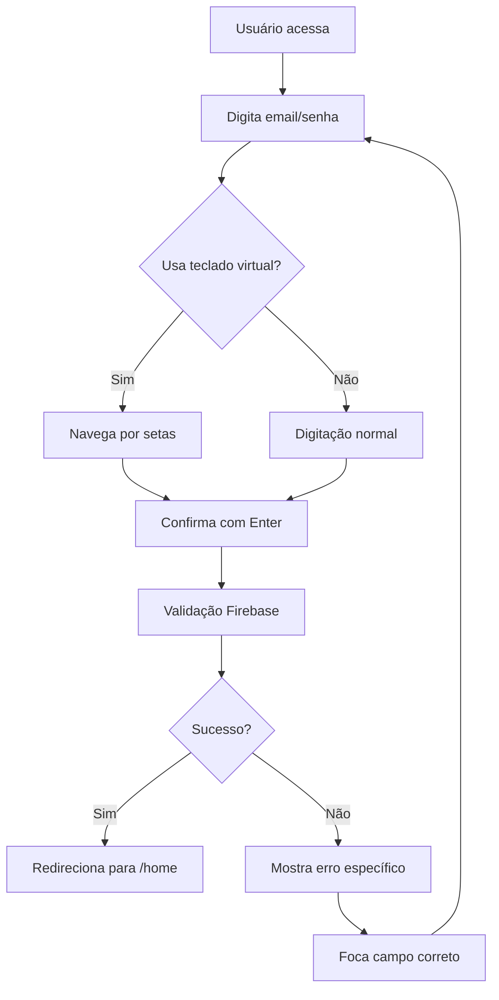

# 🎮 IsaacPlay Login

<div align="center">


**Sistema de login moderno e acessível para o IsaacPlay**  
*Pensado para TV, desktop e mobile com experiência fluida para teclado físico, controle remoto e mouse/touch*

[🚀 **Ver Demo**](#) | [📖 **Documentação**](#como-funciona) | [🛠️ **Instalar**](#instalação)

</div>

---

## ✨ **Principais Diferenciais**

### 🎯 **Experiência Universal**
- **🖥️ TV & Totens**: Navegação perfeita com controle remoto
- **💻 Desktop**: Teclado físico + teclado virtual integrados
- **📱 Mobile**: Touch + teclado virtual responsivo
- **♿ Acessibilidade**: Totalmente navegável por teclado

### 🔐 **Autenticação Inteligente**
- **Firebase Auth**: Apenas autenticação, sem backend próprio
- **Autocomplete preservado**: Sugestões do navegador funcionam normalmente
- **Validações amigáveis**: Feedback visual claro e foco automático
- **Erros específicos**: Mensagens personalizadas para cada tipo de erro

### 🎨 **Design Netflix-Inspired**
- **Layout responsivo**: Adapta-se a qualquer tela
- **Título centralizado**: "ISAACPLAY" nunca corta ou transborda
- **Containers proporcionais**: Login e teclado virtual sempre equilibrados
- **Cores e tipografia**: Paleta Netflix com fontes modernas

---

## 🚀 **Tecnologias Utilizadas**

| Tecnologia | Versão | Propósito |
|------------|--------|-----------|
|  | 18.0+ | Interface e hooks |
|  | 10.0+ | Autenticação |
|  | 5.0+ | Build e dev server |
|  | 5.0+ | Tipagem estática |

---

## 💡 **Como Foi Pensado**

### 🎮 **Para Ambientes de TV**
```
┌─────────────────────────────────────┐
│           ISAACPLAY                 │
├─────────────────┬───────────────────┤
│   Login Form    │ Virtual Keyboard  │
│                 │                   │
│ [Email]         │ [Q][W][E][R][T]   │
│ [Password]      │ [A][S][D][F][G]   │
│ [Entrar]        │ [Z][X][C][V][B]   │
│                 │ [@gmail][@yahoo]  │
└─────────────────┴───────────────────┘
```

**Navegação por Controle Remoto:**
- ⬆️⬇️⬅️➡️ **Setas**: Movem entre campos e teclas
- 🔘 **Enter**: Ativa campo/tecla selecionada
- ❌ **ESC**: Fecha teclado virtual, volta ao email
- 🔄 **Tab**: Navegação sequencial entre elementos

### 🖥️ **Para Desktop**
- **Teclado físico**: Digitação normal nos inputs
- **Teclado virtual**: Abre ao clicar, navegação por setas
- **Autocomplete**: Sugestões do navegador preservadas
- **Foco sincronizado**: Nunca há descompasso entre campo ativo e visual

### 📱 **Para Mobile**
- **Touch**: Clique abre teclado virtual
- **Responsivo**: Layout adapta-se ao tamanho da tela
- **Acessível**: Funciona com leitores de tela

---

## 🛠️ **Instalação e Uso**

### 📦 **Instalação**
```bash
# Clone o repositório
git clone https://github.com/seu-usuario/isaacplay.git
cd isaacplay

# Instale as dependências
npm install
```

### 🏃‍♂️ **Desenvolvimento**
```bash
# Inicie o servidor de desenvolvimento
npm run dev

# Acesse: http://localhost:5173
```

### 🏗️ **Build para Produção**
```bash
# Gere os arquivos de produção
npm run build

# Os arquivos estarão em: build/client/
```

---

## 🔑 **Como Funciona o Login**

### **Fluxo de Autenticação**


### **Navegação do Teclado Virtual**
```
┌─────────────────────────────────────┐
│           TECLADO VIRTUAL           │
├─────────────────────────────────────┤
│ [Q][W][E][R][T][Y][U][I][O][P]      │
│ [A][S][D][F][G][H][J][K][L]         │
│ [Z][X][C][V][B][N][M]               │
│ [@gmail.com][@yahoo.com][@hotmail]  │
│ [1][2][3][4][5][6][7][8][9][0]      │
│ [!][@][#][$][%][^][&][*][(][)]      │
│ [Limpar]        [Confirmar]         │
└─────────────────────────────────────┘
```

**Comandos:**
- **Setas**: Navegação fluida entre teclas
- **Enter**: Insere caractere ou executa ação
- **ESC**: Fecha teclado, volta ao email
- **Limpar**: Apaga todo o campo atual
- **Confirmar**: Move para próximo campo

---

## 🎨 **Design Responsivo**

### **Breakpoints**
```css
/* TV e Desktop Grande */
@media (min-width: 1200px) {
  .login-title { font-size: clamp(2.2rem, 8vw, 6rem); }
}

/* Desktop */
@media (max-width: 1199px) {
  .login-main-row { flex-direction: row; }
}

/* Tablet */
@media (max-width: 768px) {
  .login-main-row { flex-direction: column; }
}

/* Mobile */
@media (max-width: 480px) {
  .login-form { padding: 20px; }
}
```

### **Princípios de Design**
- **🎯 Foco visual**: Elemento ativo sempre destacado
- **⚖️ Proporção**: Containers sempre equilibrados
- **📏 Espaçamento**: Margens e paddings consistentes
- **🎨 Contraste**: Texto sempre legível
- **🔄 Transições**: Animações suaves

---

## 🔧 **Configuração Firebase**

### **1. Crie um projeto no Firebase**
```bash
# Acesse: https://console.firebase.google.com
# Crie um novo projeto
# Ative Authentication > Email/Password
```

### **2. Configure as credenciais**
```typescript
// app/firebase.ts
import { initializeApp } from 'firebase/app';
import { getAuth } from 'firebase/auth';

const firebaseConfig = {
  apiKey: "sua-api-key",
  authDomain: "seu-projeto.firebaseapp.com",
  projectId: "seu-projeto",
  // ... outras configs
};

const app = initializeApp(firebaseConfig);
export const auth = getAuth(app);
```

---

## 🐛 **Tratamento de Erros**

### **Erros Firebase Mapeados**
| Código | Mensagem | Ação |
|--------|----------|------|
| `auth/user-not-found` | "Usuário não encontrado" | Foca email |
| `auth/wrong-password` | "Senha incorreta" | Foca senha |
| `auth/invalid-email` | "Email inválido" | Foca email |
| `auth/too-many-requests` | "Muitas tentativas" | Aguarda |
| `auth/network-request-failed` | "Erro de conexão" | Verifica internet |

---

## 📊 **Performance**

### **Otimizações Implementadas**
- ✅ **Code splitting**: Carregamento sob demanda
- ✅ **Lazy loading**: Componentes carregados quando necessário
- ✅ **Memoização**: Evita re-renders desnecessários
- ✅ **Bundle otimizado**: Vite para build rápido
- ✅ **CSS otimizado**: Estilos inline para performance

### **Métricas Esperadas**
- **First Contentful Paint**: < 1.5s
- **Largest Contentful Paint**: < 2.5s
- **Cumulative Layout Shift**: < 0.1
- **First Input Delay**: < 100ms

---

## 🤝 **Contribuindo**

### **Como Contribuir**
1. 🍴 Faça um fork do projeto
2. 🌿 Crie uma branch para sua feature (`git checkout -b feature/AmazingFeature`)
3. 💾 Commit suas mudanças (`git commit -m 'Add some AmazingFeature'`)
4. 📤 Push para a branch (`git push origin feature/AmazingFeature`)
5. 🔄 Abra um Pull Request

### **Padrões de Código**
- **TypeScript**: Tipagem forte em todo o projeto
- **ESLint**: Linting automático
- **Prettier**: Formatação consistente
- **Conventional Commits**: Padrão de commits

---

## 📄 **Licença**

Este projeto está sob a licença MIT. Veja o arquivo [LICENSE](LICENSE) para mais detalhes.

---

## 🙏 **Agradecimentos**

- **Netflix**: Inspiração para o design e UX
- **Firebase**: Autenticação robusta e confiável
- **React Router**: Roteamento moderno e eficiente
- **Vite**: Build tool rápida e moderna

---

<div align="center">

**Feito com ❤️ para uma experiência de login incrível**

[⬆️ Voltar ao topo](#-isaacplay-login)

</div>
